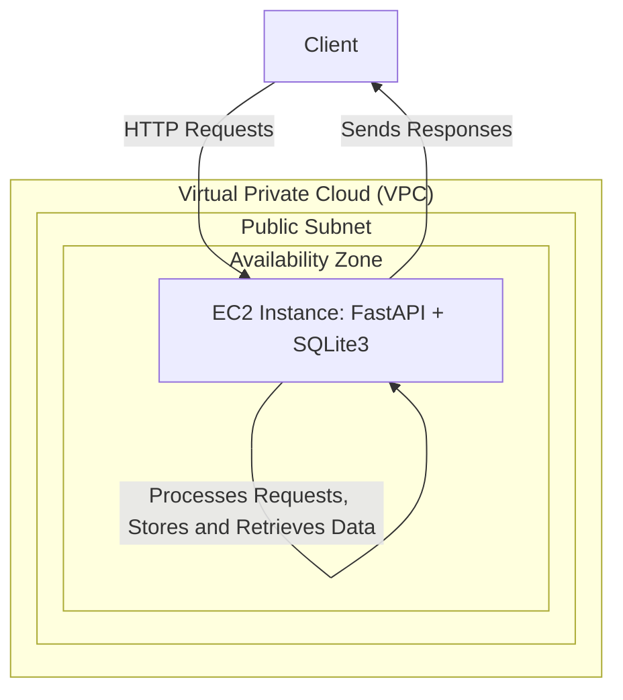

# FastAPI Docker Project

Este projeto demonstra como configurar e rodar uma aplicação FastAPI simples dentro de um contêiner Docker. Ele inclui instruções completas para configurar uma instância EC2 na AWS, clonar o repositório, construir a imagem Docker, e rodar o contêiner.

## Pré-requisitos

- Uma conta AWS com permissões para criar instâncias EC2.
- Conhecimento básico de Docker e FastAPI.

## Objetivo

Subir uma aplicação de FastAPI usando um Sqlite3 em uma máquina EC2



## Passo a Passo

### 1. Configurar uma Instância EC2 na AWS

1. **Acesse o AWS Management Console**: Vá para [AWS Management Console](https://aws.amazon.com/console/) e faça login.
2. **Lance uma Instância EC2**:
   - **Escolha a AMI**: Selecione **Amazon Linux 2023**.
   - **Escolha o Tipo de Instância**: Selecione `t2.micro` (grátis elegível para o nível gratuito da AWS).
   - **Configurar Regras de Segurança**:
     - **SSH**: Porta 22.
     - **Adicionar Regra**:
       - **Tipo**: Custom TCP Rule.
       - **Porta**: 8000 (porta para FastAPI).
       - **Source**: Anywhere (0.0.0.0/0) para permitir acesso de qualquer lugar.
   - **Lance a Instância**: Revise e inicie a instância, escolhendo um par de chaves para acesso SSH.

### 2. Acessar a Instância EC2 via AWS Connect

Va até a aba 'EC2 Instance Connect' e clique em 'Connect'

### 3. Atualizar o Sistema

```bash
sudo dnf update -y
```

### 4. Instalar Git

```bash
sudo dnf install git -y
```

### 5. Clonar o Repositório

```bash
git clone https://github.com/lvgalvao/fastapi-deploy-ec2
ls
```

### 6. Instalar Docker

```bash
sudo dnf install docker -y
```

### 7. Iniciar e Habilitar o Docker

```bash
sudo systemctl start docker
sudo systemctl enable docker
sudo usermod -aG docker ec2-user
```

### 8. Reiniciar a Sessão SSH

```bash
exit
```

Reconecte-se à instância

```bash
cd fastapi-deploy-ec2
```

### 9. Construir a Imagem Docker

```bash
docker build -t fastapi-app .
```

### 10. Executar o Contêiner Docker

```bash
docker run -p 80:80 fastapi-app
```

### 11. Acessar a Aplicação FastAPI

No seu navegador, acesse o aplicativo usando o IP público da instância EC2 na porta 8000:

```
http://<seu-endereco-ip>:8000/
```